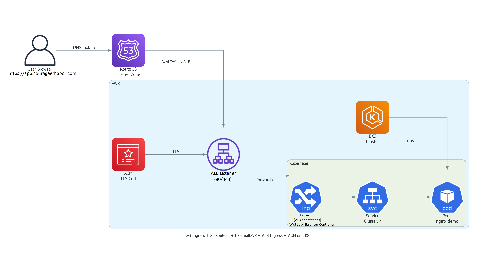

# gg-ingress-tls

**Goal:** Expose an app on **EKS (Elastic Kubernetes Service)** via **ALB (Application Load Balancer) Ingress**, with **DNS (Domain Name System)** managed in **Route 53 (AWS managed DNS (Domain Name System))** using **ExternalDNS (External Domain Name System)**, and **TLS (Transport Layer Security)** via **ACM (AWS Certificate Manager)**.

## Architecture diagram

Editable source:
- docs/diagrams/gg-ingress-tls-arch.drawio

## Environment
- **AWS (Amazon Web Services) Account:** 399717050894
- **Region:** us-east-2
- **Cluster:** green-guard-gg-eks
- **Host:** app.courageerhabor.com (delegated subdomain)

## Repo structure
- `infra/` — **eksctl (EKS control CLI)** parity config/pointer (this repo does **not** store Terraform (Infrastructure as Code) for EKS (Elastic Kubernetes Service))
- `k8s/` — Kubernetes (Container Orchestration) manifests
- `scripts/` — Bash (Bourne Again SHell) helpers
- `docs/screenshots/` — proofs
- `docs/diagrams/` — diagrams
- `.github/` — CI (Continuous Integration) config (if present)

## Proofs (screenshots)
- docs/screenshots/06-eksctl-create-finished.png
- docs/screenshots/08-alb-controller-active.png
- docs/screenshots/09-externaldns-installed.png
- docs/screenshots/10-r53-subzone-created.png
- docs/screenshots/12-namecheap-ns-delegation.png
- docs/screenshots/16-acm-issued.png
- docs/screenshots/20-browser-https.png
- docs/screenshots/22-alb-listeners.png
- docs/screenshots/23-targets-healthy.png

## Cleanup
- Delete the Ingress (Kubernetes Ingress) to remove the ALB (Application Load Balancer).
- Optionally delete the EKS (Elastic Kubernetes Service) cluster to stop costs.
